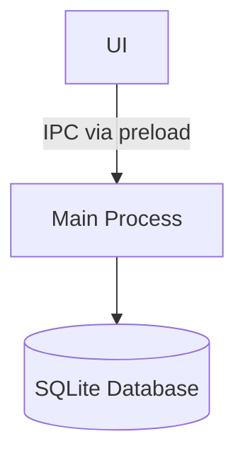

# MZO.md (Note-App / Editor)

A minimalist, local-first note app for desktop.

Built with Electron, TypeScript, Better SQLite3, and TipTap.

## Features

- Local-first note storage with SQLite
- Fast in-memory fuzzy search with fuse.js
- Markdown-focused editing with TipTap
- Export notes to Markdown, Plain Text, HTML, JSON and PDF
- Import notes from Markdown, Plain Text, HTML and JSON
- Resolve external file changes with local JIT sync
- Focus mode and read-only mode
- Adjustable editor width (Ultrawide support)
- Light and dark theme support
- Persistent settings with electron-store
- Sanitized rendering with DOMPurify
- Runtime validation with Zod

## Stack

- Electron
- TypeScript
- Better SQLite 3
- TipTap
- fuse.js
- electron-vite
- Vite
- DOMPurify
- Zod
- tinykeys
- Lucide
- Tippy.js

## Install

Requirements:

- Node.js 20+
- npm 10+

```bash
git clone https://github.com/MZO26/MDEditor.git
cd MDEditor
npm install
npm run dev
```

## Scripts

| Command              | Description                           |
| -------------------- | ------------------------------------- |
| `npm run dev`        | Start development mode                |
| `npm run build`      | Build production app                  |
| `npm run pack:mac`   | Build macOS app                       |
| `npm run pack:win`   | Build Windows app                     |
| `npm run pack:linux` | Build Linux app                       |
| `npm run typecheck`  | Run TypeScript type check             |
| `npm run rebuild`    | Rebuild better sqlite 3 native module |

## Keyboard Shortcuts

Shortcuts use `$mod` which maps to `Ctrl` on Windows/Linux and `Cmd` on macOS.

## App Shortcuts

| Shortcut              | Action                |
| --------------------- | --------------------- |
| `Mod + N`             | Create new note       |
| `Mod + F`             | Open global search    |
| `Mod + O`             | Toggle sidebar        |
| `Mod + Shift + T`     | Toggle toolbar        |
| `Mod + Shift + R`     | Toggle read-only mode |
| `Mod + Shift + W`     | Set editor width      |
| `Mod + ,`             | Open settings         |
| `Mod + +` / `Mod + =` | Zoom in               |
| `Mod + -`             | Zoom out              |
| `Mod + 0`             | Reset zoom            |
| `F11`                 | Toggle focus mode     |

### Editor Shortcuts

| Shortcut                  | Action                      |
| ------------------------- | --------------------------- |
| `Mod + Z`                 | Undo                        |
| `Mod + Y`                 | Redo                        |
| `Mod + Shift + Z`         | Redo                        |
| `Mod + B`                 | Bold                        |
| `Mod + I`                 | Italic                      |
| `Mod + Shift + X`         | Strikethrough               |
| `Mod + Shift + H`         | Highlight                   |
| `Mod + E`                 | Inline code                 |
| `Mod + Alt + 1`           | Heading 1                   |
| `Mod + Alt + 2`           | Heading 2                   |
| `Mod + Alt + 3`           | Heading 3                   |
| `Mod + Shift + 7`         | Ordered list                |
| `Mod + Shift + 8`         | Bullet list                 |
| `Mod + Shift + 9`         | Task list                   |
| `Mod + Shift + B`         | Blockquote                  |
| `Mod + Alt + C`           | Code block                  |
| `Mod + Shift + -`         | Horizontal rule             |
| `Mod + Alt + T`           | Insert table                |
| `Mod + Alt + I`           | Insert image                |
| `Mod + Alt + Arrow Down`  | Add row after               |
| `Mod + Alt + Arrow Up`    | Add row before              |
| `Mod + Alt + Arrow Right` | Add column after            |
| `Mod + Alt + Arrow Left`  | Add column before           |
| `Mod + Alt + Backspace`   | Delete table                |
| `Mod + Alt + Enter`       | Open Link                   |
| `Mod + Shift + F`         | Toggle focus mode in editor |

## Architecture

### Directory Structure

```text
.
├── electron/       # Main process
├── shared/         # Shared types, constants, schemas
└── src/            # UI, editor, styles, state
```

### Data Flow



## Security

Designed with security in mind:

- **Context Isolation** — Renderer and main process are strictly separated via Electron's `contextBridge`
- **No `nodeIntegration`** — Node.js APIs are never exposed to the renderer
- **Data Validation & Sanitization** — HTML content is strictly sanitized before rendering to prevent XSS, while non-HTML payloads are validated against robust Zod Schemas
- **Secure IPC Communication** — IPC Channels are protected by Zod Schema validation and built-in rate limiting
- **Local-Only Storage** — No external network requests; all data stays on your machine

## What this project tries to demonstrate

- Desktop app architecture with Electron
- Type-safe development with TypeScript
- Secure IPC boundaries
- Local-first application design
- SQLite schema design
- Rich editor integration without a frontend framework
- Native module handling with `electron-rebuild`
- Separation between main / renderer / shared

## Bug reports

If you find a bug, please open an issue with reproduction steps and any useful context.

## License

MIT
